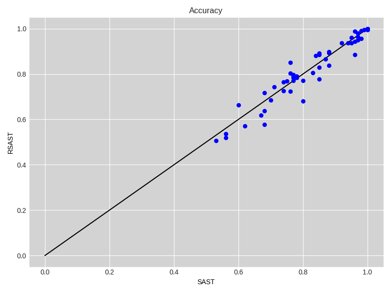
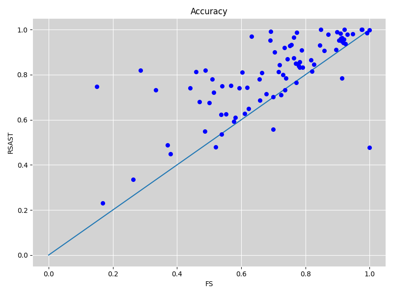
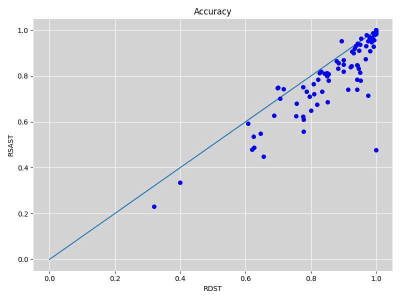

# RSAST: Random Scalable and Accurate Subsequence Transform for Time Series Classification

RSAST is a shapelet-based time series classification method based on SAST. But, aiming to overcome scalability issues. 

### Results RSAST

- [Results Default Split](./ExperimentationRSAST/results_default_split.csv)

- [Results 10 Resamplings](./ExperimentationRSAST/results_10resampling.csv)

- [Results Comparison RSAST](./ExperimentationRSAST/results_comparison_rsast.csv)

- [Execution time regarding the number of series](./ExperimentationRSAST/results_comparison_accuracy/df_overall_comparison_scalability_number_of_seriesLR.csv)

- [Execution time regarding series length](./ExperimentationRSAST/results_comparison_accuracy/df_overall_comparison_scalability_series_length.csv)

### RSAST, SAST and STC

#### Pairwise accuracy comparison

|  |  |
| -------------------------------------------------- | ---------------------------------------------------- |

#### Critical difference diagram

### Shapelet Approaches

#### Pairwise accuracy comparison

|  |  |  |

#### Critical difference diagram

