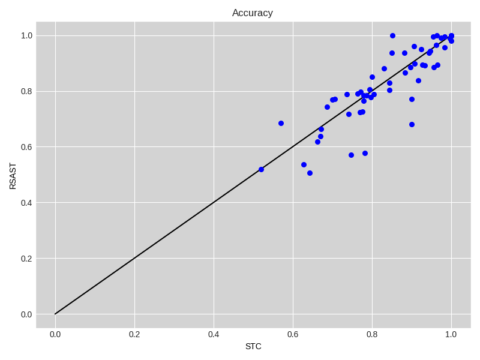

# RSAST: Random Scalable and Accurate Subsequence Transform for Time Series Classification

RSAST is a shapelet-based time series classification method based on SAST. But, aiming to overcome scalability issues. 


### Results RSAST

- [Results Default Split](./ExperimentationRSAST/results_default_split.csv)

- [Results 10 Resamplings](./ExperimentationRSAST/results_default_split.csv)

- [Execution time regarding the number of series](./ExperimentationRSAST/results_comparison_accuracy/df_overall_comparison_scalability_number_of_seriesLR.csv)

- [Execution time regarding series length](./ExperimentationRSAST/results_comparison_accuracy/df_overall_comparison_scalability_series_length.csv)


### RSAST, SAST and STC

#### Pairwise accuracy comparison

|  |  |
| -------------------------------------------------- | ---------------------------------------------------- |

#### Critical difference diagram


### STC-k vs STC

#### Pairwise accuracy comparison

|     |  |
| --------------------------------------------------- | ----------------------------------------------------- |
|  |  |

#### Critical difference diagram


### SAST vs STC

|  |  |
| ---------------------------------------------- | --------------------------------------------- |

#### Critical difference diagram


#### Percentage of wins per problem type


### SAST vs others shapelets methods

#### Pairwise accuracy comparison

|  |  |
| ------------------------------------------------- | ----------------------------------------- |


#### Critical difference diagram


#### Percentage of wins per problem types


### SAST vs SOTA

#### Pairwise accuracy comparison

|  |  |
| ------------------------------------------------------------ | ------------------------------------------------------------ |
|                                                              |                                                              |


#### Percentage of wins per problem type


### Scalability plots

- Regarding the length of time series


- Regarding the number of time series in the dataset


## Usage

```python
import numpy as np
from sast.utils_sast import *
from sast.sast import *
from sklearn.linear_model import RidgeClassifierCV
from sktime.datasets import load_UCR_UEA_dataset

ds='Chinatown' # Chosing a dataset from # Number of classes to consider
rtype="numpy2D"

X_train, y_train = load_UCR_UEA_dataset(name=ds, extract_path='data', split="train", return_type=rtype)

X_test, y_test = load_UCR_UEA_dataset(name=ds, extract_path='data', split="test", return_type=rtype)

clf = RidgeClassifierCV(alphas=np.logspace(-3, 3, 10))
rsast_ridge = RSAST(n_random_points=10, nb_inst_per_class=10, len_method="both")
rsast_ridge.fit(X_train, y_train)


prediction = rsast_ridge.predict(X_test)
```

### Dependencies

- numpy == 1.18.5
- numba == 0.50.1
- scikit-learn == 0.23.1
- sktime == 0.5.3

